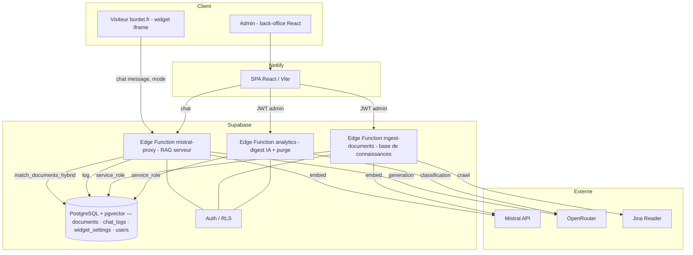

# Assistant Bordet — Chatbot RAG & back-office

Assistant conversationnel pour **[bordet.fr](https://www.bordet.fr)** (outillage et machines pour le travail du bois : tournage, sculpture, affûtage, ébénisterie). Le chatbot répond aux visiteurs en s'appuyant **exclusivement** sur une base de connaissances vectorielle (produits, articles de blog, ouvrages), avec un back-office admin pour piloter les prompts, enrichir la base et analyser les conversations.

> **En bref** : React + Supabase (Postgres/pgvector + Edge Functions Deno) + Mistral/OpenRouter. RAG 100 % côté serveur, durci contre l'exfiltration et l'hallucination. Widget embarquable sur n'importe quel site.

---

## Sommaire

- [Fonctionnalités](#fonctionnalités)
- [Stack technique](#stack-technique)
- [Architecture](#architecture)
- [Structure du dépôt](#structure-du-dépôt)
- [Démarrage rapide (développement)](#démarrage-rapide-développement)
- [Variables d'environnement & secrets](#variables-denvironnement--secrets)
- [Sécurité](#sécurité-en-un-coup-dœil)
- [Documentation détaillée](#documentation-détaillée)

---

## Fonctionnalités

### Côté visiteur
- 💬 **Chatbot RAG** : répond à partir du catalogue et des guides Bordet, cite les fiches produit avec leur lien, ne renvoie jamais vers un concurrent.
- 🧩 **Widget embarquable** : un `<script>` à coller sur n'importe quelle page (`bordet.fr` ou autre), le chat s'ouvre dans une iframe.
- 🛡️ **Anti-hallucination** : seules les URLs, prix et références présents dans le contexte récupéré survivent (filtres déterministes côté serveur).

### Côté back-office (admin)
- 📊 **Analytics** : volume de conversations, taux « sans réponse », coût estimé, thèmes/intentions (classification IA), questions sans réponse → bouton d'ajout à la base, explorateur de transcripts.
- 🛢️ **Base de connaissances** : ajout de contenu par **copier-coller**, **import PDF** (extraction + nettoyage IA) ou **crawl d'une URL bordet.fr**, avec **étape de relecture** avant écriture, dédoublonnage, et CRUD complet.
- ⚙️ **Paramètres** : édition en direct des prompts (client / marketing), statut de l'IA et de la base, et **gestion des utilisateurs** (comptes, droits).
- 🧪 **Modèle configurable** : le modèle de chat se change par simple réglage (via OpenRouter), sans redéploiement.

---

## Stack technique

| Couche | Technologies |
|---|---|
| **Frontend** | React 18, TypeScript, Vite, Tailwind CSS, Zustand, React Router, Recharts, pdf.js |
| **Backend** | Supabase — PostgreSQL + **pgvector**, **Edge Functions** (Deno), Auth (GoTrue), RLS |
| **LLM** | **Mistral** (`mistral-embed` pour les embeddings, `mistral-medium/large` en secours), **OpenRouter** (modèle de chat prod, ex. `google/gemini-3.1-flash-lite`) |
| **Extraction** | `deno-dom` (parsing HTML), lecteur **Jina** (`r.jina.ai`) pour contourner le blocage anti-bot d'Oxatis |
| **Hébergement** | Frontend sur **Netlify** (auto-deploy sur `main`), backend sur **Supabase** |

---

## Architecture



**Principe clé — le RAG est 100 % côté serveur.** Le client n'envoie que `{ message, mode, history }`. La fonction `mistral-proxy` fait tout : embedding de la requête, recherche hybride (vectorielle + lexicale), assemblage du prompt + contexte, génération, puis nettoyage déterministe des URLs/prix/références. **Aucune réponse n'est possible sans passer par la base** — même via un appel direct à l'API.

Détails complets : **[docs/ARCHITECTURE.md](docs/ARCHITECTURE.md)**.

---

## Structure du dépôt

```
.
├── src/                          # Frontend React
│   ├── pages/                    # Dashboard (chat), Settings, Knowledge, Analytics, Login, Admin
│   ├── components/               # Layout, ChatInterface, PublicWidget, Widget…
│   ├── lib/                      # api.ts (chat), ingest.ts (base de connaissances), supabase.ts
│   ├── store/                    # Zustand : auth, chat, config
│   └── types/
├── supabase/
│   ├── functions/
│   │   ├── mistral-proxy/        # Proxy LLM durci + RAG serveur
│   │   ├── ingest-documents/     # Ajout/gestion de la base de connaissances (admin)
│   │   ├── analytics/            # Digest IA des conversations + purge RGPD
│   │   └── widget-status/        # Statut du widget
│   └── migrations/               # SQL (schéma, RPC, RLS, durcissement)
├── public/                       # widget.js (embed), _redirects (SPA)
└── docs/                         # Documentation détaillée
```

---

## Démarrage rapide (développement)

**Prérequis** : Node 18+, un projet Supabase (avec `pgvector`), la [CLI Supabase](https://supabase.com/docs/guides/cli), et des clés Mistral/OpenRouter.

```bash
# 1. Dépendances
npm install

# 2. Variables d'environnement (voir section dédiée)
#    Créer un fichier .env avec VITE_SUPABASE_URL et VITE_SUPABASE_ANON_KEY

# 3. Lancer le front en dev
npm run dev            # http://localhost:5173

# 4. (une fois) appliquer le schéma et déployer les fonctions -> voir docs/DEPLOIEMENT.md
```

Scripts : `npm run dev` · `npm run build` · `npm run preview` · `npm run lint`.

Le déploiement complet (SQL + Edge Functions + front) est décrit dans **[docs/DEPLOIEMENT.md](docs/DEPLOIEMENT.md)**.

---

## Variables d'environnement & secrets

| Emplacement | Nom | Rôle |
|---|---|---|
| **Netlify** (build front) | `VITE_SUPABASE_URL` | URL du projet Supabase |
| **Netlify** | `VITE_SUPABASE_ANON_KEY` | Clé anon (publique) Supabase |
| **Supabase secrets** | `MISTRAL_API_KEY` | Embeddings + génération de secours |
| **Supabase secrets** | `OPENROUTER_API_KEY` | Modèle de chat prod + classification analytics |
| **Supabase secrets** | `JINA_API_KEY` *(optionnel)* | Quotas plus élevés pour le crawl via Jina |
| *(auto-injectés)* | `SUPABASE_URL`, `SUPABASE_SERVICE_ROLE_KEY`, `SUPABASE_ANON_KEY` | Fournis par le runtime Edge Functions |

> ⚠️ La `service_role` et les clés LLM **ne quittent jamais le serveur**. Le navigateur ne connaît que l'URL et la clé anon.

---

## Sécurité en un coup d'œil

- **RAG serveur** : le client ne fournit ni prompt ni contexte ; impossible d'obtenir une réponse « libre ».
- **RLS fermée** : accès `anon` **révoqué** sur `documents` ; lecture via RPC `SECURITY DEFINER` bornée.
- **Modèle forcé** côté serveur, température basse, tailles bornées, **allowlist d'origine**.
- **Circuit-breaker de coût** : plafond de tokens quotidien (réservation atomique) + **kill-switch** (`widget_settings.proxy_enabled`).
- **Gestion admin** protégée par **JWT Supabase + `is_admin`** (vérifié côté serveur, pas seulement dans l'UI).
- **RGPD** : les transcripts de conversation sont purgés automatiquement après 90 jours ; aucun identifiant client stocké.

Détails : **[docs/ARCHITECTURE.md § Sécurité](docs/ARCHITECTURE.md#sécurité)**.

---

## Documentation détaillée

| Document | Contenu |
|---|---|
| **[docs/ARCHITECTURE.md](docs/ARCHITECTURE.md)** | Technique : schéma de base, pipeline RAG, edge functions (endpoints/actions), sécurité, modèle de données |
| **[docs/GUIDE_ADMIN.md](docs/GUIDE_ADMIN.md)** | Fonctionnel : parcours back-office (base de connaissances, analytics, prompts, utilisateurs), embarquer le widget |
| **[docs/DEPLOIEMENT.md](docs/DEPLOIEMENT.md)** | Ops : migrations SQL, déploiement des fonctions, variables, recette |
